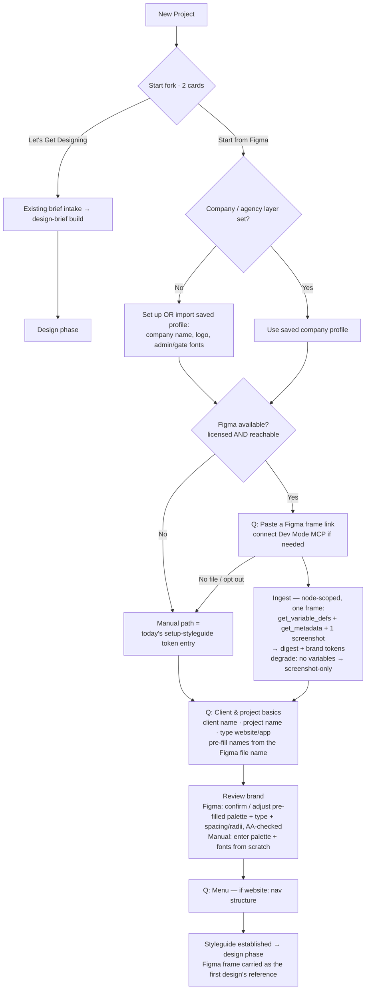

# Spec: Onboarding reframe — "Start from Figma" as the second card

**Status:** spec / plan of record
**Date:** 2026-08-25
**Depends on:** `figma-ingest-spec.md` (the import plumbing this card fronts). NOT built yet.
**Decision (Rob, 2026-08-25):** reframe the New-Project start fork so the second card leads with
Figma import, with manual setup as a graceful fallback *inside* it. **Two cards, not three.**
"Let's Get Designing" stays completely intact as the first card.

## 1. Why reframe, not replace

"Client Setup" and "Import from Figma" are different jobs: setup *establishes* the brand; Figma
import is a *source that feeds* it (it pre-fills the client's `--ta-*` tokens from
`get_variable_defs`). So we don't swap one for the other — we make Figma the **hero of the setup
path**, and keep manual entry as the fallback so we never strand the two segments a straight swap
would break:

- designers whose client has a logo + hex codes + a font but **no Figma file**, and
- users **without the Figma license** (the import is license-gated, same tier as export).

For both, the card silently degrades to today's step-by-step setup. Nobody hits a dead end.

## 2. The revised start fork

Head is unchanged ("Let's make something" / "Pick how you'd like to begin."). Two cards:

| Card | Label | Description |
|---|---|---|
| 1 (unchanged) | **Let's Get Designing** | Jump straight in: tell me a little about the site and I'll use your answers to start designing. |
| 2 (reframed) | **Start from Figma** | Bring in a Figma frame and I'll pre-fill the brand (colors, type, spacing), then set up your project. No Figma file? You can set it up by hand. |

Copy lives in `copy.js` `intake.start` (rename `clientSetup*` → `figmaStart*`, keep the manual
strings for the fallback screen). The card is **always clickable** — the license/reachability check
happens *inside*, not by hiding the card.

## 3. The flow

## 4. Step-by-step — the questions, and what's NEW vs today

The Figma path is the **same setup sequence** as Client Setup today, with exactly **one new input**
(the frame link) plus a connection check, and the token step **converted from blank-entry to
review-a-pre-fill**. Everything else is unchanged.

| # | Step | Question / input | New vs today? | Pre-filled from Figma? |
|---|---|---|---|---|
| 0 | Card pick | (choose "Start from Figma") | reframed label | — |
| 1 | Company / agency layer | Import saved company profile, or set: company name, logo, admin/gate fonts | unchanged (today's `setup-project` company block) | No (agency layer ≠ client's Figma) |
| 2 | Figma availability | (silent: licensed AND Dev Mode MCP reachable?) | **new gate** | — |
| 3 | Figma frame | **"Paste a link to a Figma frame"** + connect Dev Mode MCP if not connected. Secondary link: *"No Figma file? Set it up step by step."* | **NEW — the one added input** | — |
| 4 | Ingest | (automatic: pull variables + metadata + one screenshot → digest) | **new step, no input** | — |
| 5 | Client / project basics | client name · project name · project type (website / app) | unchanged | Names *suggested* from the Figma file name (editable) |
| 6 | Brand review | Figma path: **confirm / adjust** the pre-filled palette, type, spacing, radii (AA-safety pass). Manual path: enter palette + fonts from scratch | **changed** — review-a-pre-fill instead of blank entry | ⭐ Yes — `--ta-*` colors + type + spacing + radii from `get_variable_defs` |
| 7 | Menu | if website: nav / menu structure | unchanged | (future: infer from named sections) |
| 8 | Done | → design phase; the imported frame is carried as the **first design's reference** | new handoff | — |

**Net for the designer:** one new paste field, a connection check, and the "pick your colors/fonts"
screen becomes "here's what I read from your Figma, tweak if needed." That's the whole delta.

## 5. Degrade matrix — never hard-fail

| Condition | Behavior |
|---|---|
| Not Figma-licensed | Step 3 hidden; card drops straight to the **manual path** (identical to today's Client Setup). Optional "unlock Figma import" nudge. |
| Licensed, MCP not reachable | Step 3 prompts to open the Figma desktop app / Dev Mode MCP (or paste a token). Can't connect → offer the manual path. |
| Frame has no Variables | Ingest degrades to **screenshot-only** digest: no token pre-fill, but the frame still rides as a design reference and a feel guide for manual token entry. |
| Frame URL invalid / node unreachable | Inline error, re-prompt; manual path always available. |
| User clicks "set it up step by step" | Jump to the manual path at any point. |

## 6. What Figma pre-fills vs what stays asked

- **Pre-filled (the win):** client palette → `--ta-*`, type roles, spacing scale, radii — straight
  from `get_variable_defs` at near-perfect fidelity, then AA-checked. This is step 6.
- **Still asked (Figma variables don't carry these reliably):** the agency/company layer, client &
  project names (suggested from file name), project type, menu. These are the same questions as
  today's setup.

## 7. Phasing (rides `figma-ingest-spec.md`)

- **P1 — the card + brief-grade import.** Reframe the fork, add step 3 (frame link) + step 4
  (ingest → digest), carry the frame as a design reference. Brand step 6 stays manual for now. This
  ships the reframed card even before token pre-fill exists.
- **P2 — brand pre-fill (the sleeper win).** Step 6 becomes review-a-pre-fill from
  `get_variable_defs` (`--ta-*` + type/space/radii), AA-safe. This is where the card earns its
  headline.
- **P3 — polish.** Frame picker (choose which frame), multi-frame, name suggestions from file name,
  section → scaffold mapping (infer the menu from named sections).

## 8. Open questions

- **Company layer ordering:** ask the agency block before or after the Figma link? (Draft: before,
  so the saved-profile path keeps the Figma path feeling like "just paste and go".)
- **First-design handoff:** after setup, auto-offer "design the imported frame" vs land on an empty
  design phase with the frame available as a reference? (Draft: offer it.)
- **Unlicensed card treatment:** silent manual fallback vs a visible "Figma (locked)" affordance
  that nudges the license. (Draft: silent fallback + a small unlock hint.)
- **Naming:** "Start from Figma" vs "Set up from Figma" vs "Import from Figma". (Draft: "Start from
  Figma" — parallel to "Get Designing".)
