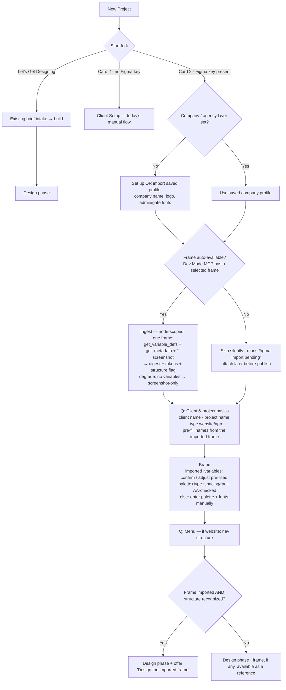

# Spec: Onboarding reframe — "Start from Figma" as the second card

**Status:** spec / plan of record
**Date:** 2026-08-25
**Depends on:** `figma-ingest-spec.md` (the import plumbing this card fronts). NOT built yet.
**Decision (Rob, 2026-08-25):** reframe the New-Project start fork so the second card leads with
Figma import, with manual setup as a graceful fallback *inside* it. **Two cards, not three.**
"Let's Get Designing" stays completely intact as the first card.

## 1. Why reframe, not replace

"Client Setup" and "Import from Figma" are different jobs: setup *establishes* the brand; Figma
import is a *source that feeds* it (it pre-fills the client's `--ta-*` tokens from
`get_variable_defs`). So we don't swap one for the other — when Figma is available we make it the
**hero of the setup path**; when it isn't, slot 2 is simply today's manual Client Setup. Nobody
hits a dead end, and nobody sees a card they can't use.

## 2. The revised start fork (card 2 is license-conditional)

Head is unchanged ("Let's make something" / "Pick how you'd like to begin."). Card 1 is always
present. **Card 2's identity swaps on the Figma key** (Rob 2026-08-25, decision #1), so there is no
in-card license gate and no dead card:

| Slot | Condition | Label | Description |
|---|---|---|---|
| 1 (always) | — | **Let's Get Designing** | Jump straight in: tell me a little about the site and I'll use your answers to start designing. |
| 2 · key **present** | Figma-licensed | **Start from Figma** | Pull your brand straight from Figma, then set up your project. |
| 2 · key **absent** | unlicensed | **Client Setup** (today's manual) | Brand a new project step by step (logo, fonts, colors), then design. |

An unlicensed user never sees a Figma card — slot 2 is the manual Client Setup they already have.
Copy lives in `copy.js` `intake.start`: keep **both** the `figmaStart*` and existing `clientSetup*`
strings and pick by license presence at render. No manual fallback lives *inside* the Figma card.

## 3. The flow

The Figma import is **opportunistic, never a blocker** (decision #2): on entry we try to auto-pull
the currently-selected frame from the connected Dev Mode MCP. If one is available, we ingest it and
pre-fill the brand. If nothing is available, we **do not prompt for a URL** — setup proceeds exactly
like manual Client Setup, and the Figma import is deferred (attachable later, before publish). There
is **no internal license/availability gate** (decision #3): the card only shows when licensed, and
reachability is handled by auto-or-defer.

## 4. Step-by-step — the questions, and what's NEW vs today

The Figma path is the **same setup sequence** as Client Setup, with **no added question** — the
import is automatic when a frame is present, and the token step **converts from blank-entry to
review-a-pre-fill** when it succeeds. Nothing new is asked of the designer.

| # | Step | Question / input | New vs today? | From Figma? |
|---|---|---|---|---|
| 0 | Card pick | (choose "Start from Figma") | reframed label | — |
| 1 | Company / agency layer | Import saved company profile, or set: company name, logo, admin/gate fonts | unchanged (`setup-project` company block) | No (agency layer ≠ client's Figma) |
| 2 | Auto-import | (automatic, no input: pull the selected frame if available → ingest; else skip + defer) | **new step, no question** | — |
| 3 | Client / project basics | client name · project name · project type (website / app) | unchanged | Names *suggested* from the imported frame (editable) |
| 4 | Brand | imported+variables: **confirm / adjust** the pre-filled palette, type, spacing, radii (AA pass). Otherwise: enter palette + fonts | **changed** when imported — review-a-pre-fill vs blank | ⭐ Yes — `--ta-*` + type + spacing + radii from `get_variable_defs` |
| 5 | Menu | if website: nav / menu structure | unchanged | (future: infer from named sections) |
| 6 | Done | → design phase; if structure recognized, offer "Design the imported frame" (§4a) | new handoff | — |

**Net for the designer:** zero new questions. When a frame is present, the "pick your colors/fonts"
screen becomes "here's what I read from your Figma, tweak if needed"; when it isn't, the flow is
exactly today's setup and the import waits until before-publish.

## 4a. The "Design the imported frame" handoff (structure-gated)

Offered right after setup **only when the ingest recognized real page structure** (decision:
Rob 2026-08-25) — a frame that is just colors + type (a token/styleguide file) has no design to
build, so we don't offer it, we only keep its tokens.

The signal comes from `get_metadata` (the layer tree we already pull). Heuristic for "recognized
structure": the frame reads as a **page**, e.g. ≥ 2 stacked section-level auto-layout frames, or
named layers matching common page regions (hero / header / footer / features / pricing / cta), at a
page-scale width. A styleguide/component sheet (swatch grids, text-style specimens, a single
component, no vertical page composition) is **not** recognized → no offer.

- **Recognized →** land in the design phase with a prominent "Design the imported frame" action
  (kicks a `/design` build that uses the frame's structure + screenshot as the layout reference).
- **Not recognized →** land in the normal design phase; the frame (if any) stays available as a
  style reference, but we never imply there is a layout to reproduce.

Note it is a **heuristic** — false negatives are safe (designer can still start from a brief);
false positives are the risk, so bias toward *not* offering when structure is ambiguous. Tunable
as P3 alongside the section→scaffold mapping.

## 5. Degrade matrix — never hard-fail

| Condition | Behavior |
|---|---|
| No Figma key | Slot 2 is the manual **Client Setup** card; the Figma path never appears (decision #1). |
| Licensed, no frame selected / MCP not reachable | Auto-import finds nothing → **skip silently**, proceed with manual setup, mark "Figma import pending" for before-publish. No prompt, no block (decision #2). |
| Frame has no Variables | Ingest degrades to **screenshot-only** digest: no token pre-fill, but the frame still rides as a reference + a feel guide for manual token entry. |
| Frame has tokens but no page structure | Brand pre-fills; the "Design the imported frame" offer is **withheld** (§4a). |
| Import fails mid-pull | Keep whatever was retrieved (e.g. tokens without a clean screenshot); never abort setup. |

## 6. What Figma pre-fills vs what stays asked

- **Pre-filled (the win):** client palette → `--ta-*`, type roles, spacing scale, radii — straight
  from `get_variable_defs` at near-perfect fidelity, then AA-checked. This is step 6.
- **Still asked (Figma variables don't carry these reliably):** the agency/company layer, client &
  project names (suggested from file name), project type, menu. These are the same questions as
  today's setup.

## 7. Phasing (rides `figma-ingest-spec.md`)

- **P1 — the conditional card + brief-grade import.** License-swap slot 2, auto-import the selected
  frame (no URL prompt) + ingest → digest, carry the frame as a design reference, structure-gate the
  handoff (§4a). Brand step stays manual for now. Ships the reframed card even before token pre-fill.
- **P2 — brand pre-fill (the sleeper win).** The brand step becomes review-a-pre-fill from
  `get_variable_defs` (`--ta-*` + type/space/radii), AA-safe. This is where the card earns its
  headline.
- **P3 — polish.** Frame picker / multi-frame, the deferred "import before publish" surface, name
  suggestions from the frame, and section → scaffold mapping (infer the menu from named sections).

## 8. Open questions

- **Company-layer ordering:** ask the agency block before or after the auto-import attempt? (Draft:
  before, so the saved-profile path keeps the Figma path feeling like "just launch and go".)
- **Deferred-import surface:** where the "Figma import pending" affordance lives and how it re-runs
  the ingest + (re)fills brand tokens before publish. Its own small spec, tied to the publish flow.
- **Auto-import mechanism:** exactly how "a frame is available" is detected via the Dev Mode MCP
  (current selection vs an open file) — depends on the MCP's selection surface; confirm at build.

**Decided (Rob 2026-08-25):** card is license-conditional, slot 2 swaps to manual Client Setup when
absent (#1); import is auto-or-defer with no in-flow URL prompt (#2); no internal availability gate
(#3); "Design the imported frame" is structure-gated (§4a); label is "Start from Figma".
