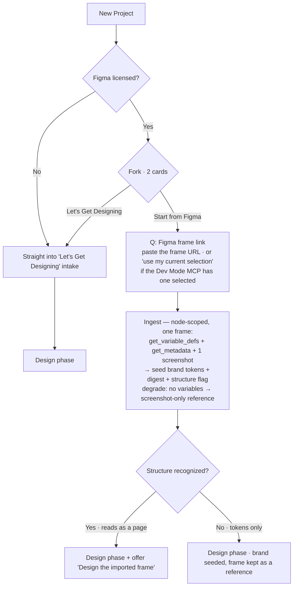

# Spec: Onboarding reframe — "Start from Figma" (licensed second card)

**Status:** spec / plan of record
**Date:** 2026-08-25 (revised after Rob's review)
**Depends on:** `figma-ingest-spec.md` (the import plumbing this card fronts). NOT built yet.
**Decisions:** see §7. In short: the New-Project fork is Figma-licensed-only; unlicensed users skip
it and go straight to "Let's Get Designing"; onboarding front-loads no branding (that's opt-in at
publish); the "Start from Figma" card's one input is the frame URL.

## 1. Shape

New-Project entry is **license-conditional**:

- **Figma unlicensed → no fork at all.** Drop straight into "Let's Get Designing" (the intake).
  Least friction: an unlicensed user has exactly one path, so we never make them choose.
- **Figma licensed → a two-card fork:** "Let's Get Designing" + "Start from Figma".

Branding is **not** front-loaded in either path. Onboarding never asks for company/agency info and
never runs an up-front brand setup; the existing **publish-time "this project isn't branded" nudge**
is where the designer opts into branding. (The old "Client Setup" card is retired for now — Rob to
reconsider separately.)

## 2. The fork (licensed only)

| Card | Label | Description |
|---|---|---|
| 1 | **Let's Get Designing** | Jump straight in: tell me a little about the site and I'll use your answers to start designing. |
| 2 | **Start from Figma** | Import a Figma frame to seed the brand, and design from it if it's a page. |

Copy lives in `copy.js` `intake.start`. When Figma is unlicensed, the fork is **skipped entirely** —
render the Get Designing intake directly (no card chooser, no "pick how you'd like to begin").

## 3. The flow

The frame's tokens are **seeded silently** — there is no mandatory brand-review step in onboarding.
Formal review/adjust of the brand happens later (the publish nudge / styleguide). That keeps the
Figma path to essentially **one input**.

## 4. Questions asked

The Figma path asks the designer **one thing**: the frame link.

| # | Step | Input | Notes |
|---|---|---|---|
| 1 | Frame link | Paste the Figma frame URL (`figma.com/design/:key/…?node-id=X`). Optional shortcut: **"use my current selection"** if the Dev Mode MCP is connected with a frame selected. | The one input — this is the point of the card, not friction. |
| 2 | Ingest | (automatic, no input) pull variables + metadata + one screenshot → seed tokens + digest + structure flag | §6 |
| 3 | Handoff | (automatic) structure recognized → offer "Design the imported frame"; else land in design phase with brand seeded | §5 |

No company step, no client/project-name step, no brand-review step in onboarding — those are either
seeded from Figma or deferred to the publish-time branding opt-in.

## 5. "Design the imported frame" handoff (structure-gated)

Offered right after import **only when the ingest recognized real page structure** — a frame that is
just colors + type (a token/styleguide file) has no layout to build, so we don't offer it; we only
keep its tokens.

The signal comes from `get_metadata` (the layer tree we already pull). Heuristic for "recognized
structure": the frame reads as a **page** — e.g. ≥ 2 stacked section-level auto-layout frames, or
named layers matching common page regions (hero / header / footer / features / pricing / cta), at a
page-scale width. A styleguide/component sheet (swatch grids, text specimens, a single component, no
vertical page composition) is **not** recognized → no offer.

- **Recognized →** design phase with a prominent "Design the imported frame" action (kicks a
  `/design` build that uses the frame's structure + screenshot as the layout reference).
- **Not recognized →** normal design phase; the frame stays available as a *style* reference, but we
  never imply there is a layout to reproduce.

It is a **heuristic** — false negatives are safe (the designer can still start from a brief); false
positives are the risk, so **bias toward not offering** when structure is ambiguous. Tunable in P3
alongside the section→scaffold mapping.

## 6. Ingest + degrade matrix (never hard-fail)

Import reuses the **same Figma MCP connection as export** — "offline + MCP only," gated on a Figma
editor seat (export filters `whoami` to editor seats). Import is simply the **read** side of that
connection: `get_variable_defs` (tokens) + `get_metadata` (structure) + one `get_screenshot` (feel);
it never calls the write tools (`use_figma`) export uses. Exact read-by-URL vs read-selection surface
is confirmed at build.

| Condition | Behavior |
|---|---|
| No Figma license | No fork; straight to "Let's Get Designing". The Figma card never appears. |
| Frame unreachable (MCP not connected / no access to the file) | Inline error on the frame-link step; retry, or fall back to "Let's Get Designing". Never a dead end. |
| Frame has no Variables | Screenshot-only digest: no token seed, but the frame rides as a reference + feel guide. |
| Frame has tokens but no page structure | Brand seeded; the "Design the imported frame" offer is **withheld** (§5). |
| Import fails mid-pull | Keep whatever was retrieved (e.g. tokens without a clean screenshot); continue to the design phase. |

## 7. Decisions & phasing

**Decisions (Rob, 2026-08-25):**
- Unlicensed → **no fork**, straight to "Let's Get Designing" (least friction).
- Licensed → two-card fork ("Let's Get Designing" + "Start from Figma").
- **No up-front company/brand setup** in onboarding; branding is opt-in at the publish-time nudge.
- "Start from Figma" input = the **frame URL** (+ optional "use current selection").
- "Design the imported frame" is **structure-gated** (§5).
- MCP = the **same connection + editor-seat gate as export**; import uses the read tools.
- The old **"Client Setup" card is retired** for now (Rob to reconsider separately).

**Phasing (rides `figma-ingest-spec.md`):**
- **P1 — licensed fork + brief-grade import.** Show the fork when licensed / skip when not; frame-link
  import → digest + reference; structure-gated handoff. Seed tokens if variables are present.
- **P2 — brand pre-fill (the sleeper win).** AA-safe token seeding from `get_variable_defs` (`--ta-*`
  + type/space/radii), with an optional review surface.
- **P3 — polish.** Frame picker / multi-frame, the "use current selection" convenience, name
  suggestions from the frame, and section → scaffold mapping (infer the menu from named sections).

## 8. Open questions

- **Read mechanism:** exact Dev Mode MCP surface for read-by-URL vs read-current-selection — confirm
  at build (informs whether "use my current selection" ships in P1 or P3).
- **Brand review:** confirm brand seeding is purely silent + publish-nudge, or whether a light
  one-screen confirm belongs in onboarding. (Draft: silent seed + publish nudge only.)
- **"Client Setup" future:** parked. If it returns, decide whether it is its own card, a mode inside
  the publish-time branding flow, or folded into Get Designing.
